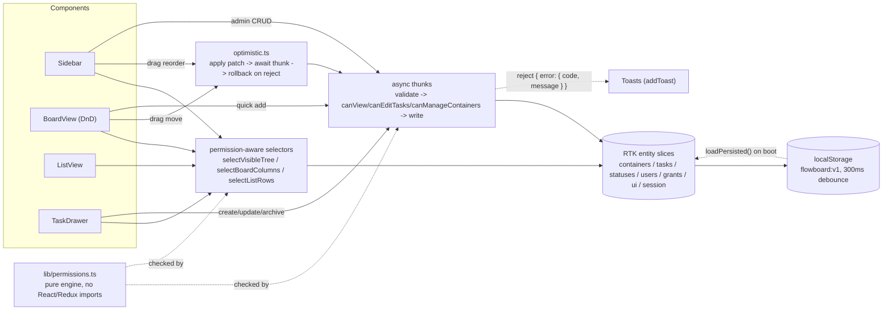

# Flowboard

A mini project-management app (ClickUp/Asana at hobby scale) built for the SDE2 Frontend take-home. Single workspace, container hierarchy, kanban + list views, a task drawer with subtasks, and a client-side permission model with an in-app user switcher. **Frontend-only** — a typed Redux store seeded from fixtures, persisted to `localStorage`.

**Live demo:** https://project-management-app-mu-liart.vercel.app
**Demo video:** _to be added_

## Run locally

```bash
npm install && npm run dev
```

- `npm test` — Jest + React Testing Library suite (141 tests across 18 suites)
- `npm run typecheck` — strict TypeScript (`tsc --noEmit`)
- `npm run build` — production build (`tsc --noEmit` then `vite build`)

## Architecture



Both read and write paths run through the same pure permission engine: selectors filter what reaches the UI, thunks re-check before mutating. The UI never makes an access decision itself.

## Data model

- **`Container`** — one shape with a `type` discriminator (`workspace → space → folder → list`), parent type enforced by `validateContainerParent`. Sibling order is a float `position` (`src/lib/ordering.ts`): new siblings append at `max + POSITION_GAP`, and inserts between two siblings take the arithmetic midpoint (`positionBetween`) — no integer re-indexing on every drag, no rebalancing pass (acceptable at demo scale; repeated insertions at the same point would eventually need renormalisation). Soft delete via `archivedAt`: `archiveContainer` walks descendants to a fixpoint and stamps them all, rather than removing rows — this keeps `createdAt`/history intact and makes "Reset demo data" a trivial reseed instead of needing an undo stack. There is no restore UI.
- **`Task`** — belongs to exactly one `primaryListId`; `statusId` must belong to that list's status set (`validateStatusInList`). Subtasks are one level deep only (`parentTaskId`, enforced by `validateSubtaskParent` — a subtask cannot itself have children, and must live in its parent's list). Moving a task across lists (`moveTask`) remaps its subtasks' statuses by category into the destination list's set and carries them along, and re-checks permission on **both** the source and destination list.
- **`Status`** — owned per list, not shared: each list seeds its own `todo` / `in_progress` / `done` triple, and `Sprint 1` additionally seeds an extra "In Review" (`in_progress` category) to demonstrate that status sets are per-list, not global. Status sets are seed-defined and not editable in the UI.
- **`Grant`** — `{ id, resourceId, userId, mode: 'allow' | 'deny' }` attached to any container id, read by the permission engine as part of a node's ancestor chain.

## How permissions are enforced in the client

The pure engine lives in `src/lib/permissions.ts` and has no React or Redux imports — it's a plain function over `{ containers, users, grants }`. `canView(entities, userId, containerId)` walks the node-to-root chain and applies four rules, **in this order**:

1. **Archived is never visible, checked before anything else** — if any node in the chain is archived, the answer is `false` even for an admin. (Nothing archived should ever leak back into view, regardless of role.)
2. **Admin bypass** — if the user's role is `admin`, everything not already excluded by rule 1 is visible.
3. **Deny on self-or-ancestor always wins** — if any grant for this user on any node in the chain has `mode: 'deny'`, the node is hidden, full stop. Deny is checked before the private/allow rule, so a deny cannot be overridden by an allow elsewhere in the same chain.
4. **A private node anywhere in the chain requires an allow somewhere in that chain** — if every node in the chain is public, the node is visible by default; if any node in the chain is `private`, the user needs at least one `allow` grant somewhere on that chain, or the node is hidden.

A fifth concept, **pass-through**, isn't a visibility rule but a navigation affordance: `getVisibleContainers` computes `viewableIds` (nodes `canView` returns `true` for) and then separately computes `passThroughIds` — ancestors of a viewable node that are *not themselves* viewable. The sidebar renders pass-through ancestors dimmed and non-openable, purely so a user with access to a deeply-nested list still sees a navigable path down to it instead of a node appearing to float with no parent.

**Both the read and the write path go through this engine, and only this engine — the store is the enforcement point, not the UI:**

- **Reads:** every view-facing selector in `src/store/selectors.ts` (`selectVisibleTree`, `selectAccessibleSelectedListId`, `selectVisibleLists`, `selectCanManage`) calls into `canView` / `canManageContainers`. Switching the active user in the demo re-derives these selectors and the UI reshapes instantly — no separate "can I see this" check is hand-rolled in a component.
- **Writes:** every thunk in `src/store/thunks/containerThunks.ts` and `taskThunks.ts` re-checks permission against current state immediately before writing (`canManageContainers` for container CRUD/reorder; `canEditTasks` for task create/update/archive/move) and rejects with `{ error: { code: 'FORBIDDEN', message } }` on failure — the same `AppError` shape used for `NOT_FOUND`, `VALIDATION`, and `NETWORK` errors. A component cannot bypass this by skipping a disabled-button check; the thunk itself refuses the write. `moveTask` is notable for checking **both** the source list and the destination list, using an explicit `fromListId` passed in by the optimistic wrapper rather than trusting `task.primaryListId` from `getState()` (see `AI_USAGE.md` — the optimistic patch mutates that field before the thunk runs).
- Container structure CRUD (create/rename/archive/reorder containers) is **admin-only** by design, not grant-resolved; members can edit tasks in any list they can view. An extension path for roles would carry a role on the grant itself (e.g. `mode: 'allow' | 'deny' | 'edit'`) and resolve "can this member edit this container's structure" through the exact same ancestor-chain walk used for visibility, plus a team-based grant (`grants` keyed by `teamId` instead of `userId`, resolved by expanding team membership before the chain walk) rather than inventing a second code path.

**Seeded demo** (`src/store/seed.ts`): three users — **Alice** (admin), **Bob** and **Carol** (members).
- **Alice** sees the entire tree: Engineering, Marketing (even though it's private), Q4 Launch, Website Revamp, and the private Leadership Roadmap list.
- **Bob** has an explicit `deny` on the Marketing space (`sp-mkt`), so Marketing and everything under it (Website Revamp, Content Calendar, Leadership Roadmap) disappears from his tree entirely. He sees only Engineering (Q4 Launch: Backlog, Sprint 1).
- **Carol** has an `allow` on the private Leadership Roadmap list (`l-roadmap`) and a `deny` on the Q4 Launch folder (`f-q4`). The deny hides Q4 Launch and its lists (Backlog, Sprint 1) outright — deny wins regardless of the allow elsewhere. The allow on Leadership Roadmap makes that list visible despite being private, and its ancestors (Marketing, Website Revamp) appear as dimmed pass-through rows so the path down to it stays navigable, even though Marketing itself is private and Carol has no direct grant on it.

## Stretch goals attempted (2)

The assignment allows at most two; these are the two claimed:

1. **Optimistic UI on drag-and-drop with rollback** — board card moves and sidebar sibling reorders apply to the store synchronously, then the confirming thunk runs; on rejection the pre-drag snapshot is restored and a toast explains why (`src/store/thunks/optimistic.ts`). Demo it with the "Simulate failures" toggle in the top bar, then drag a card.
2. **Deployed preview** — see the live demo link above (added once deployed).

## Trade-offs: what was cut, what's next

- **No router, and the selection is session-local.** The selected list lives in `state.ui.selectedListId`, not the URL — so there are no deep links or shareable list URLs. `ui` is also deliberately excluded from the slice `persistence.ts` saves and `main.tsx` restores (`containers`, `tasks`, `statuses`, `users`, `grants`, `session`), so the selection itself resets on reload even though the underlying data doesn't: a refreshed page lands back on "select a list from the sidebar." Next step: URL-synced routes (e.g. `/list/:id`) backed by the same selector, which would give the selection a durable home without persisting `ui` directly.
- **Container structure CRUD is admin-only**; members can edit tasks in any list they can see, but cannot create/rename/archive/reorder containers. Extending this to per-member structural edit rights would mean carrying a role on each grant (`allow` / `deny` / `edit`) and resolving "can edit structure here" through the same ancestor-chain walk `canView` already does, plus team-based grants resolved by expanding team membership before that same walk — no second permission code path.
- **Float positions with midpoint insertion, no rebalancing.** `positionBetween` takes the arithmetic midpoint between two neighbours; `nextPosition` appends at `max + POSITION_GAP`. This is fine at demo scale, but repeated insertions at the same point shrink the gap between floats indefinitely; a real deployment would need a periodic renormalisation pass that reassigns evenly-spaced integer-ish positions.
- **Archive rather than hard delete, with no restore UI.** `archivedAt` is a timestamp, not a boolean, and archiving a container cascades to all descendants. There's no way to un-archive from the UI; "Reset demo data" (reseed) covers the demo need. Next step: an archive browser with restore.
- **Sidebar drag reorders siblings only — no re-parenting.** `computeReorderPosition` only ever recomputes a node's `position` among its existing siblings; a node's `parentId` never changes via drag. This keeps the parent-type invariants (`validateContainerParent`: list must live in a folder, folder in a space, etc.) safe without needing a re-parenting UI that would have to validate drop targets against that same table.
- **Optimistic updates only on drag-and-drop; the task drawer's forms just await and toast on failure.** One optimistic-apply-confirm-rollback pattern (DnD): the store updates immediately and rolls back on rejection. The drawer's update/move/archive actions use the plainer alternative instead — dispatch the thunk, `await` it, and raise a toast if it rejects — with no separate loading/pending indicator rendered while the await is in flight. Deliberately not two overlapping ways of handling the same kind of async state.
- **Jest rather than Vitest**, in a Vite project. A deliberate choice for this submission; `@swc/jest` keeps the suite fast (141 tests in ~2.5s) without pulling in Vitest's own config surface.
- **Known accessibility limitation:** while the task drawer (a Headless UI `Dialog`) is open, Headless UI makes the rest of the app tree `inert`. The toast layer is deliberately mounted as its own direct `<body>` child (`src/components/ui/Toasts.tsx`, via `createPortal`) rather than inside the React app tree or inside Headless UI's own `<Portal>` — both of those land inside the subtree Headless UI inerts, which was a real bug found and fixed (see `AI_USAGE.md`). The current mount point keeps toasts clickable and announced while the drawer is open (`role="alert"`, 4-second auto-dismiss), but a **known remaining limitation** is that a keyboard-only user cannot `Tab` into the toast layer to dismiss it early, because it sits outside the dialog's focus trap — they can still click it, or just wait for auto-dismiss.
- **Status sets are seeded per list and are not editable in the UI.** Sprint 1 ships an extra "In Review" status to demonstrate the per-list model works; adding/renaming/reordering statuses would need its own admin surface.

## Styling notes

Tailwind CSS v4 utility classes only. Theme tokens (`brand` colors, priority/status colors, `radius-card`, `shadow-card`, `font-sans`) are declared as `@theme` variables in the single `src/index.css` — v4's replacement for a `tailwind.config` theme extension, not hand-written CSS. The **one documented exception** to utility-classes-only: dnd-kit requires an inline `style={{ transform, transition }}` on draggable elements to position them during a drag, used in exactly two places — `src/components/board/TaskCard.tsx` and `src/components/sidebar/TreeNodeItem.tsx`.

## AI usage

See [AI_USAGE.md](./AI_USAGE.md) for the full process and the specific bugs and bad assertions it caught. Short version: the app was built with Claude Code from a written spec through a task-by-task plan, one implementation pass per task followed by an independent diff-only review pass per task, with fix rounds until clean. The review loop is what caught an optimistic-update ordering bug that silently disabled a cross-list permission check, a drag-destination off-by-one, and an accessibility defect behind a flaky test — all described there with the specific commits.
